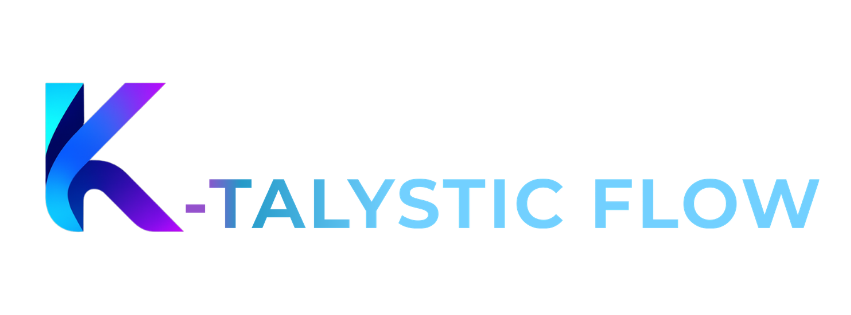

```{raw} html
<div style="text-align: center; padding: 2.5rem 0 1.5rem 0;">
  
  <h1 style="font-size: 2.4rem; margin: 0; color: #2c2c2c;">K-talysticFlow (KAST)</h1>
  <p style="font-size: 1.05rem; color: #666; margin-top: 0.6rem; max-width: 600px; margin-left: auto; margin-right: auto;">
    <strong>K</strong>-atalystic <strong>A</strong>utomated <strong>S</strong>creening
    <strong>T</strong>askflow — Automated Deep Learning for Molecular Bioactivity Prediction
  </p>
  <hr style="margin: 1.8rem auto; width: 50%; border: none; border-top: 2px solid #9c7aff;"/>
</div>
```

```{toctree}
:maxdepth: 2
:caption: Getting Started

getting-started/overview
getting-started/installation
getting-started/quick-start
```

```{toctree}
:maxdepth: 2
:caption: User Guide

user-guide/pipeline
user-guide/step-by-step
user-guide/data-preparation
user-guide/parallel-processing
user-guide/outputs
```

```{toctree}
:maxdepth: 2
:caption: Support

support/faq
support/troubleshooting
support/configuration
```

## Key Features

- **Interactive Menu** — Easy step-by-step workflow
- **Parallel Processing** — 5-10x faster on large datasets
- **Deep Learning** — DeepChem + TensorFlow neural networks
- **K-Prediction Score** — Proprietary scoring for molecular ranking
- **Full Validation** — ROC/AUC, Cross-Val, Enrichment Factor
- **One-Click Setup** — Automated for Windows and Linux